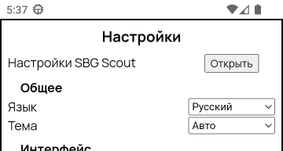
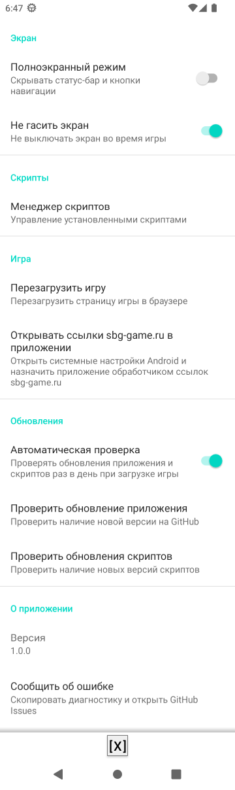
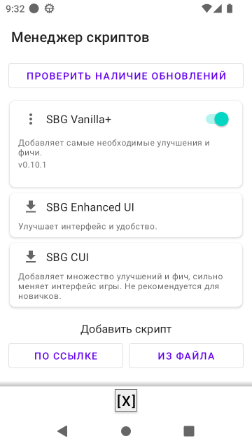

#  SBG Scout

[![Latest release][release-badge]][releases]
[![Release date][release-date-badge]][releases]
[![Downloads][downloads-badge]][releases]
[![Downloads@latest][downloads-latest-badge]][releases]
[![SBG][sbg-badge]][sbg]

[![Build status][ci-badge]][ci]
[![License MIT][license-badge]][license]

Android-клиент для игры [SBG](https://sbg-game.ru/) со встроенным менеджером юзерскриптов.

## Возможности

- **Менеджер юзерскриптов** — установка по URL или из файла, переустановка, тогглы, предустановленные Vanilla+ и EUI (CUI в один клик без ввода URL), выбор любой версии с GitHub, обнаружение конфликтов, безопасная инжекция с поддержкой `@run-at`, JS-бриджи (clipboard, share, настройки игры)
- **Автообновление** — проверка приложения и скриптов при запуске, диалоги с release notes и прогрессом загрузки, кнопка «Обновить все» для скриптов
- **WebView с игрой** — полноэкранный immersive-режим, геолокация, синхронизация темы и языка из настроек игры, перезагрузка из настроек
- **Обработка ссылок sbg-game.ru** — если назначить SBG Scout обработчиком по умолчанию (кнопка в настройках ведёт на нужный системный экран Android одним тапом), ссылки на игру из других приложений будут открываться в SBG Scout

## Скачать

[Скачать последний APK][releases-latest]

## Скриншоты

<table>
<tr>
<td valign="top"></td>
</tr>
<tr>
<td valign="top"></td>
<td valign="top"></td>
</tr>
</table>

## Требования

- Android 8.0+ (API 26)
- Для сборки: JDK 17, Android SDK 35

## Сборка

```bash
./gradlew assembleDebug
```

## Проверка

```bash
./gradlew ktlintCheck detekt testDebugUnitTest assembleDebug
```

## Документация

- [Архитектура](docs/architecture.md)
- [Принципы разработки](docs/dev-principles.md)
- [Стиль кода](docs/codestyle.md)

[releases]: https://github.com/wrager/sbg-scout/releases
[releases-latest]: https://github.com/wrager/sbg-scout/releases/latest
[ci]: https://github.com/wrager/sbg-scout/actions/workflows/ci.yml
[license]: LICENSE
[sbg]: https://sbg-game.ru/app
[release-badge]: https://img.shields.io/github/v/release/wrager/sbg-scout?style=flat-square
[release-date-badge]: https://img.shields.io/github/release-date/wrager/sbg-scout?style=flat-square
[ci-badge]: https://img.shields.io/github/actions/workflow/status/wrager/sbg-scout/ci.yml?branch=main&style=flat-square
[downloads-badge]: https://img.shields.io/github/downloads/wrager/sbg-scout/total?style=flat-square&cacheSeconds=3600
[downloads-latest-badge]: https://img.shields.io/github/downloads/wrager/sbg-scout/latest/total?style=flat-square&cacheSeconds=3600&label=downloads%40latest
[license-badge]: https://img.shields.io/github/license/wrager/sbg-scout?style=flat-square
[sbg-badge]: https://img.shields.io/website?label=sbg-game.ru/app&style=flat-square&url=https%3A%2F%2Fsbg-game.ru/app
